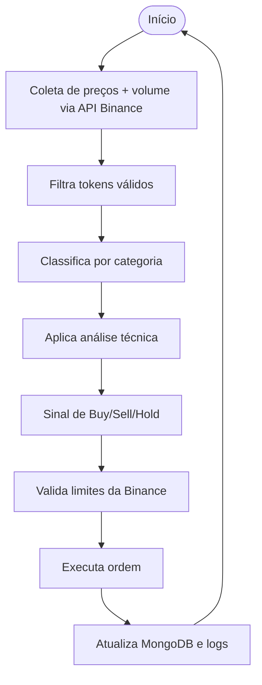

# 🤖 Crypto-Bot: Estratégia de Trading Automatizado

Este documento descreve a estratégia principal do **robo de trading automatizado**, implementado em Go com Clean Architecture, MongoDB e foco em **autonomia na tomada de decisões** para multiplicação do patrimônio em dólar.

---

## 🎯 Objetivo Principal

Aumentar o patrimônio **em dólar (USDT)** de forma autônoma, realizando trades baseados em análise técnica simples, gestão de risco e regras programáveis.

---

## 📂 Classificação da Carteira

A carteira é dividida em 3 grupos:

| Categoria     | Descrição                                                                 |
|---------------|--------------------------------------------------------------------------|
| **Reservas**  | USDT ou stablecoins. Base para segurança e liquidez.                    |
| **Especulativos** | Moedas de médio risco com boa liquidez e volume (ex: LINK, AAVE).       |
| **Small Caps**    | Ativos de alto risco, com potencial de valorização (ex: SHIB, IMX).      |

---

## 🧠 Estratégia Inteligente

### 1. **Reservas em Dólar**
- Parte da carteira (~30–50%) será mantida em USDT.
- Utilizado para compras estratégicas (ex: em quedas de preço).
- Sempre que obtivermos lucro com venda de ativos, parte será revertida para reserva.

### 2. **Seleção Automática de Ativos**
- Consulta os tokens com **maior volume** nas últimas 24h via Binance API.
- Filtra ativos com:
  - Par USDT
  - Volume > 1 milhão USD
  - Preço > $0.01
  - Exclusão de stablecoins
- Classifica automaticamente em:
  - Especulativos
  - Alto risco

### 3. **Análise Técnica Simples**
- Aplicação de indicadores como:
  - **SMA (Média Móvel Simples)**
  - **EMA**
  - **RSI** (opcional)
- Exemplo:
  - Se o preço atual < SMA → possível compra
  - Se o preço atual > SMA → possível venda

### 4. **Execução Inteligente**
- Antes de comprar ou vender:
  - Valida regras da Binance (minQty, stepSize, minNotional)
  - Ajusta automaticamente a ordem (quantidade e valor)
- A ordem só é enviada se for **válida e segura**.

---

## 🔁 Fluxo da Estratégia

---

## 📦 Armazenamento (MongoDB)

- `assets`: ativos na carteira, categorias e histórico
- `trades`: operações realizadas (compra, venda)
- `signals`: sinais identificados com timestamp e decisão
- `logs`: histórico completo das ações do bot

---

## 📌 Regras Extras

- Só executa ordens com **valor mínimo válido (NOTIONAL)**
- Sempre grava logs de cada operação e tentativa
- Reavalia oportunidades a cada ciclo (ex: 1min ou 5min)

---

## 🛠️ Futuras Melhorias

- Estratégias com múltiplos indicadores (MACD, Bollinger Bands)
- Diversificação automática com base em perfil de risco
- Painel de monitoramento Web/CLI
- Integração com Telegram para alertas e comandos